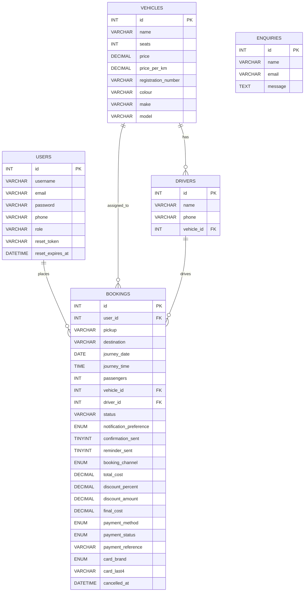

# Sprint 2 ERD

```mermaid
erDiagram
    USERS {
        INT id PK
        VARCHAR username
        VARCHAR email
        VARCHAR password
        VARCHAR phone
        VARCHAR role
        VARCHAR reset_token
        DATETIME reset_expires_at
    }

    BOOKINGS {
        INT id PK
        INT user_id FK
        VARCHAR pickup
        VARCHAR destination
        DATE journey_date
        TIME journey_time
        INT passengers
        INT vehicle_id FK
        INT driver_id FK
        VARCHAR status
        ENUM notification_preference
        TINYINT confirmation_sent
        TINYINT reminder_sent
        ENUM booking_channel
        DECIMAL total_cost
        DECIMAL discount_percent
        DECIMAL discount_amount
        DECIMAL final_cost
        ENUM payment_method
        ENUM payment_status
        VARCHAR payment_reference
        ENUM card_brand
        VARCHAR card_last4
        DATETIME cancelled_at
    }

    VEHICLES {
        INT id PK
        VARCHAR name
        INT seats
        DECIMAL price
        DECIMAL price_per_km
        VARCHAR registration_number
        VARCHAR colour
        VARCHAR make
        VARCHAR model
    }

    DRIVERS {
        INT id PK
        VARCHAR name
        VARCHAR phone
        INT vehicle_id FK
    }

    ENQUIRIES {
        INT id PK
        VARCHAR name
        VARCHAR email
        TEXT message
    }

    USERS ||--o{ BOOKINGS : "places"
    VEHICLES ||--o{ BOOKINGS : "assigned_to"
    DRIVERS ||--o{ BOOKINGS : "drives"
    VEHICLES ||--o{ DRIVERS : "has"
```
