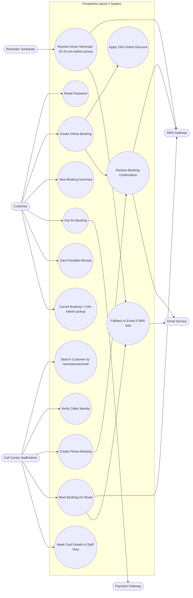

# Sprint 2 Use Case Diagram

```mermaid
flowchart LR
    Customer([Customer])
    Staff([Call Centre Staff/Admin])
    Scheduler([Reminder Scheduler])
    PayGateway([Payment Gateway])
    SmsGateway([SMS Gateway])
    EmailSvc([Email Service])

    subgraph PrivateHire Sprint 2 System
        UC1((Reset Password))
        UC2((Create Online Booking))
        UC3((View Booking Summary))
        UC4((Pay for Booking))
        UC5((Apply 15% Online Discount))
        UC6((Receive Booking Confirmation))
        UC7((Receive Driver Reminder 10-15 min before pickup))
        UC8((View Printable Receipt))
        UC9((Cancel Booking >=24h before pickup))
        UC10((Search Customer by name/phone/email))
        UC11((Verify Caller Identity))
        UC12((Create Phone Booking))
        UC13((Mark Booking On Route))
        UC14((Fallback to Email if SMS fails))
        UC15((Mask Card Details in Staff View))
    end

    Customer --> UC1
    Customer --> UC2
    Customer --> UC3
    Customer --> UC4
    Customer --> UC8
    Customer --> UC9

    Staff --> UC10
    Staff --> UC11
    Staff --> UC12
    Staff --> UC13
    Staff --> UC15

    Scheduler --> UC7

    UC2 --> UC5
    UC2 --> UC6
    UC4 --> PayGateway
    UC6 --> SmsGateway
    UC6 --> EmailSvc
    UC7 --> SmsGateway
    UC7 --> UC14
    UC14 --> EmailSvc
    UC13 --> SmsGateway
    UC13 --> UC14
    UC12 --> UC6
```
